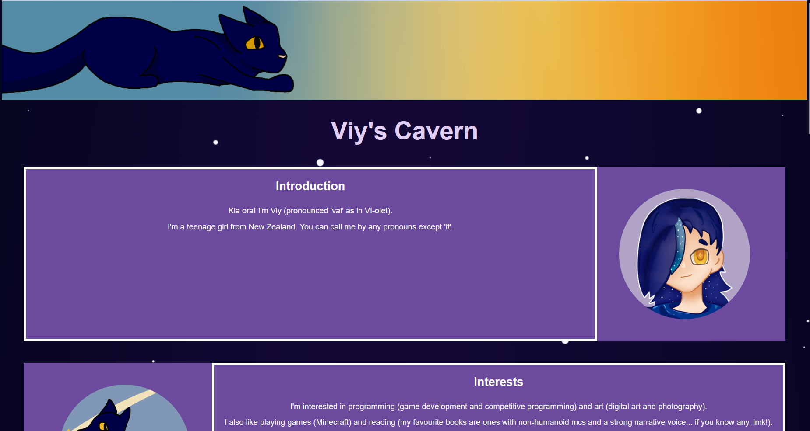

# Viy's Cavern

My personal site, where you can learn more about Viy (me!). View it at [https://viywolf.github.io/viys-cavern/](https://viywolf.github.io/viys-cavern/).

This site is a simple, one page website with a few different sections such as an introduction, project showcase, and socials. It also somewhat scales for mobile users, though it is intended to be viewed on a desktop.

Made with html and css in VSCode. Deployed with GitHub pages. All art by me except for the Sound Waves header, which was made by clov3r_leaf.